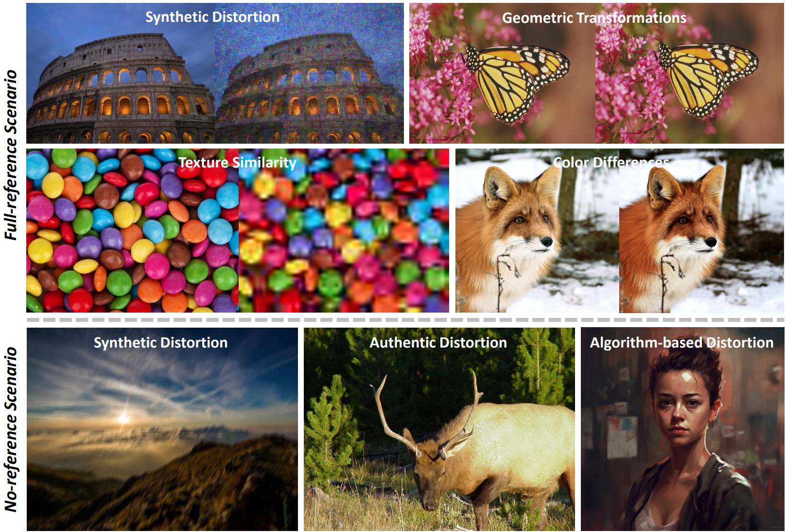

<div align="center">
<div>
  <h1>
  A Comprehensive Study of Multimodal Large Language Models for Image Quality Assessment
  </h1>
</div>

<div>
  <a href="https://scholar.google.com/citations?user=QW1JtysAAAAJ&hl=en&oi=ao" target="_blank">Tianhe Wu</a><sup>1,2</sup>,
  <a href="https://scholar.google.com/citations?user=sfzOyFoAAAAJ&hl=en&oi=ao" target="_blank">Kede Ma</a><sup>2*</sup>,
  <a target="_blank">Jie Liang</a><sup>3</sup>,
  <a href="https://scholar.google.com/citations?user=4gH3sxsAAAAJ&hl=en&oi=ao" target="_blank">Yujiu Yang</a><sup>1*</sup>,
  <a href="https://scholar.google.com/citations?user=tAK5l1IAAAAJ&hl=en&oi=ao" target="_blank">Lei Zhang</a><sup>3,4</sup>
</div>

<div>
  <sup>1</sup>Shenzhen International Graduate School, Tsinghua University<br>
  <sup>2</sup>Department of Computer Science, City University of Hong Kong<br>
  <sup>3</sup>OPPO Research Institute<br>
  <sup>4</sup>The Hong Kong Polytechnic University
</div>

<div>
  <a href="https://arxiv.org/abs/2403.10854" target="_blank">Preprint Paper</a>
</div>

<p align="center">
    
</p>
</div>


> *While Multimodal Large Language Models (MLLMs) have experienced significant advancement on visual understanding and reasoning, their potentials to serve as powerful, flexible, interpretable, and text-driven models for Image Quality Assessment (IQA) remains largely unexplored. In this paper, we conduct a comprehensive and systematic study of prompting MLLMs for IQA. Specifically, we first investigate nine prompting systems for MLLMs as the combinations of three standardized testing procedures in psychophysics (i.e., the single-stimulus, double-stimulus, and multiple-stimulus methods) and three popular prompting strategies in natural language processing (i.e., the standard, in-context, and chain-of-thought prompting). We then present a difficult sample selection procedure, taking into account sample diversity and uncertainty, to further challenge MLLMs equipped with the respective optimal prompting systems. We assess three open-source and one close-source MLLMs on several visual attributes of image quality (e.g., structural and textural distortions, color differences, and geometric transformations) in both full-reference and no-reference scenarios. Experimental results show that only the close-source GPT-4V provides a reasonable account for human perception of image quality, but is weak at discriminating fine-grained quality variations (e.g., color differences) and at comparing visual quality of multiple images, tasks humans can perform effortlessly.* 


## 🔧 Dataset Preparation
We assess three open-source and one close-source MLLMs on several visual attributes of image quality (e.g., structural and textural distortions, color differences, and geometric transformations) in both full-reference and no-reference scenarios.

**Full-reference scenario**:
- Structural and textural distortions (synthetic distortion): [FR-KADID](https://database.mmsp-kn.de/kadid-10k-database.html)
- Geometric transformations: [Aug-KADID](https://drive.google.com/file/d/1F1E5Iibn5qKt58HAxQ_600ypDVSvd6sl/view?usp=drive_link)
- Texture similarity: [TQD](https://drive.google.com/file/d/1F1E5Iibn5qKt58HAxQ_600ypDVSvd6sl/view?usp=drive_link)
- Color difference: [SPCD](https://github.com/hellooks/CDNet)

**No-reference scenario**:
- Structural and textural distortions (synthetic distortion): [NR-KADID](https://database.mmsp-kn.de/kadid-10k-database.html)
- Structural and textural distortions (authentic distortion): [SPAQ](https://github.com/h4nwei/SPAQ)
- Structural and textural distortions (algorithm-based distortion): [AGIQA-3K](https://github.com/lcysyzxdxc/AGIQA-3k-Database)

## 💫 Sample Selection
To execute computational sample selection method for selecting difficult data, implement with below command.
```
python sample_selection.py
```


## :hammer_and_wrench: Quick Inference
Before inference with MLLMs, please modify `settings.yaml`. Here is an example.
```
# FR_KADID, AUG_KADID, TQD, NR_KADID, SPAQ, AGIQA3K
DATASET_NAME:
  FR_KADID

# GPT-4V api-key
KEY:
  You need to input your GPT-4V API key

# single, double, multiple
PSYCHOPHYSICAL_PATTERN:
  single

# standard, cot (chain-of-thought), ic (in-context)
NLP_PATTERN:
  standard

# distorted image dataset path
DIS_DATA_PATH:
  C:/wutianhe/sigs/research/IQA_dataset/kadid10k/images

# reference image dataset path
REF_DATA_PATH:
  C:/wutianhe/sigs/research/IQA_dataset/kadid10k/images

# IC path (image paths)
IC_PATH:
  []
```

**Inference with simple command**.
```
python test_gpt4v.py
```

## BibTeX
```
@article{wu2024comprehensive,
  title={A Comprehensive Study of Multimodal Large Language Models for Image Quality Assessment},
  author={Wu, Tianhe and Ma, Kede and Liang, Jie and Yang, Yujiu and Zhang, Lei},
  journal={arXiv preprint arXiv:2403.10854},
  year={2024}
}
```

## Personal Acknowledgement
I would like to thank my two friends [Xinzhe Ni](https://scholar.google.com/citations?user=TB0b58kAAAAJ&hl=en&oi=ao) and [Yifan Wang](https://scholar.google.com/citations?hl=en&user=plGpmz0AAAAJ) in our Tsinghua 1919 group for providing valuable NLP and MLLM knowledge in my personal difficult period.

## 📧 Contact
If you have any question, please email `wth22@mails.tsinghua.edu.cn`.


